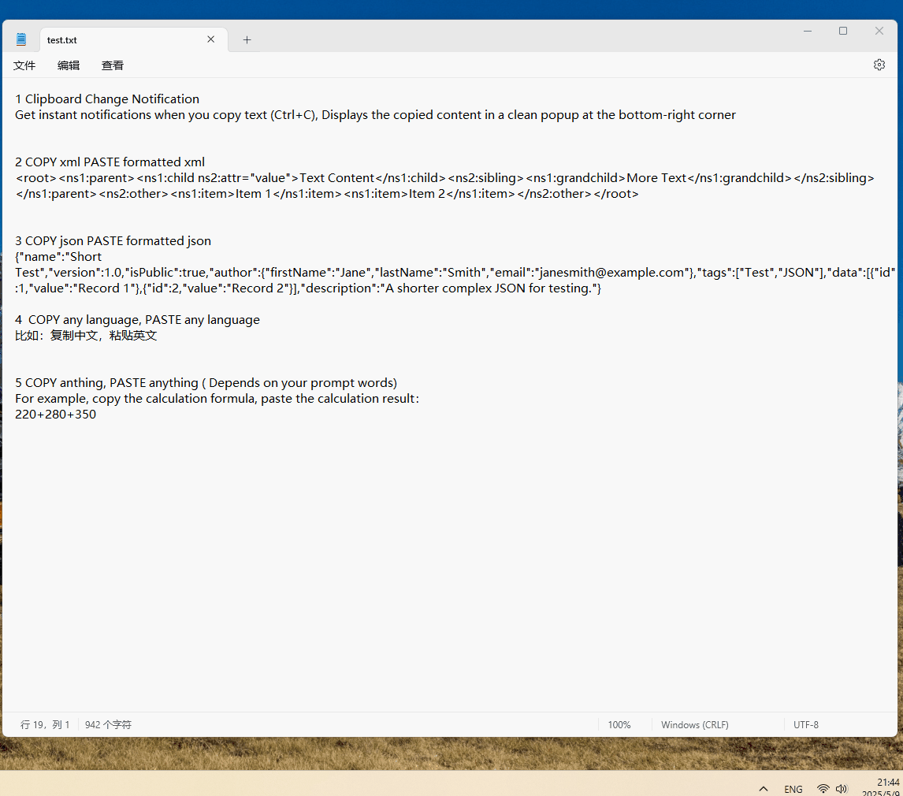

# AI Clipboard Notifier

A smart Windows clipboard utility that provides intelligent notifications and processing for copied text.

## Features

### 📋 Clipboard Change Notification
- Get instant notifications when you copy text (Ctrl+C)
- Displays the copied content in a clean popup at the bottom-right corner

### � XML/JSON Formatter
- Automatically detects and formats JSON/XML content
- Presents beautifully indented and readable structured data

### 🌍 AI-Powered Translation
- Translates any copied text to your specified language
- Supports high-quality AI translation models

### 🤖 Custom AI Processing
- Process any text with AI using your custom prompts
- Perform calculations, summarizations, transformations, and more
- Fully configurable AI instructions

## 🚀 Usage

1. **Basic Notification**
   - Simply press `Ctrl+C` to copy any text.
   - A popup will appear at the bottom-right corner showing the copied content.
2. **AI Processing Workflow**
   - Copy text (`Ctrl+C`) → Initial popup shows the raw text.
   - The system then automatically processes the text (formatting/translation/AI analysis).
   - A second popup displays the processed result.

## Installation

1. Download the latest release from [Releases](https://github.com/yourusername/ai-clipboard-notifier/releases)
2. Change your Ollama configuration in config.txt
3. Run AIClipboardNotifier.exe

## Configuration

- Right-click the system tray icon to Enable/disable specific features
- Double-click the system tray icon to Start/stop the application
- Edit config.txt
  - Configure endpoint/model/apikey/prompt to your own ollama environment
  - *Set either `ollama.enable=true` or `open-webui.enable=true` in the configuration to activate AI features.*

## Requirements

- Windows 10/11
- .NET 4.7.2 or later
- (Optional) Ollama
- (Optional) API key for AI services if using cloud-based processing

## License

This project is licensed under the MIT License - see the [LICENSE](LICENSE) file for details.
